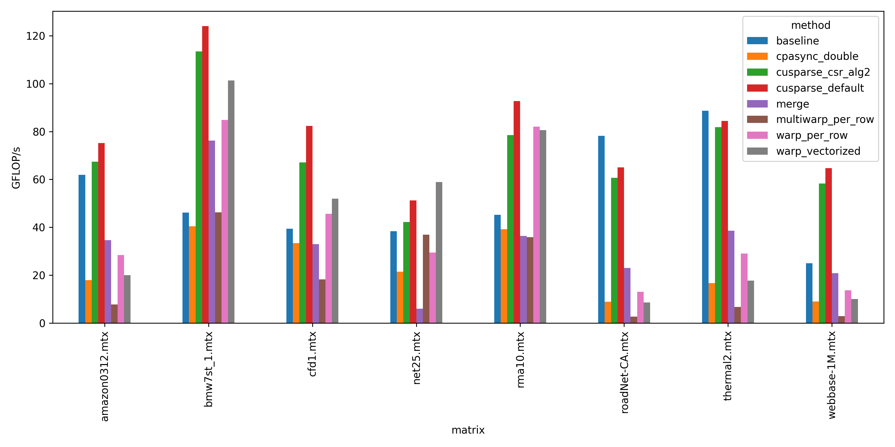

### Purpose
Infrastructure to test out SpMV optimizations that are well-known to
work in other contexts and to understand why they're coming short
for sparse formats.

We focus only on CSR here at first, using SuiteSparse.

